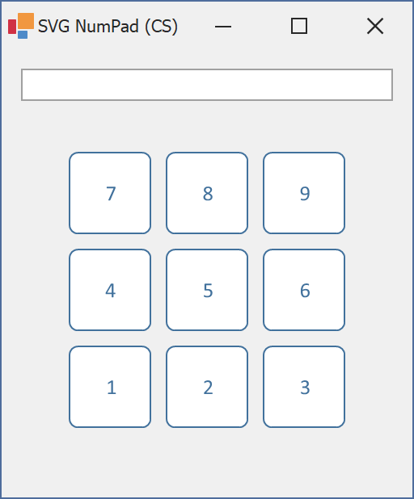

<!-- default badges list -->

[](https://supportcenter.devexpress.com/ticket/details/T1009309)
[](https://docs.devexpress.com/GeneralInformation/403183)
<!-- default badges end -->
*Files to look at*:

* [NumPadForm.cs](./CS/NumPadForm.cs) (VB: [NumPadForm.vb](./VB/NumPadForm.vb))

<!-- default file list end -->
# SvgImageBox – Virtual keyboard from SVG file

]

This example gives you an idea of how to create a virtual keyboard based on the [SvgImageBox](https://docs.devexpress.com/WindowsForms/DevExpress.XtraEditors.SvgImageBox) control. 

First, we've prepared an SVG file ([keys.svg](./Assets/Keys.svg)) that defines the button layout and styling options for our virtual keyboard.

```svg
<svg>
  <defs>
    <g id="key">
	  ...
          <path ... />
          <text x="25" text-anchor="middle" y="17" fill="#41719C" font-size="10pt" font-family="Calibri">
            <tspan id="txt" x="25" dy="12.5">[key]</tspan>
          </text>	 
    </g>
  </defs>
  <g id="keys">
         // Button layout
	 // ...
	 <use id="7" href="#key" transform="matrix(1, 0, 0, 1, 30, 30)"/>
         
  </g>
</svg>

```

After the file is loaded to the [SvgImageBox](https://docs.devexpress.com/WindowsForms/DevExpress.XtraEditors.SvgImageBox) control, the code iterates through SVG items, sets item text and ids, and then customizes the appearance settings related to the item hover and pressed states.

```cs
keysGroup = svgImageBox1.FindItemById("keys");
foreach(var key in keysGroup.Items) {
    var keyText = key.FindDescendantById($"txt_{key.Id}");
    keyText.Text = key.Id.ToUpper();
    keyText.Appearance.Hovered.FillColor = DXSkinColors.IconColors.White;
    keyText.Appearance.Pressed.FillColor = DXSkinColors.IconColors.White;
    key.Appearance.Hovered.FillColor = DXSkinColors.IconColors.Blue;
    key.Appearance.Pressed.FillColor = DXSkinColors.IconColors.Black;
}
```
Related links: [SvgImageBox.FindItemById](https://docs.devexpress.com/WindowsForms/DevExpress.XtraEditors.SvgImageBox.FindItemById(System.String)), [SvgImageItem.FindDescendantById](https://docs.devexpress.com/WindowsForms/DevExpress.XtraEditors.SvgImageItem.FindDescendantById(System.String))

The example then handles the [SvgImageBox.ItemPress](https://docs.devexpress.com/WindowsForms/DevExpress.XtraEditors.SvgImageBox.ItemPress) event
to emulate a virtual keyboard:

```cs
void OnItemPress(object sender, SvgImageItemEventArgs e) {
    /* do something */
    SendKeys.Send(e.Item.Id);
}
```

Use this example as a template for your custom applications (for instance, POS terminals) where you set up a layout of controls in an SVG file and then use the SvgImageBox control to handle clicks on individual items.

